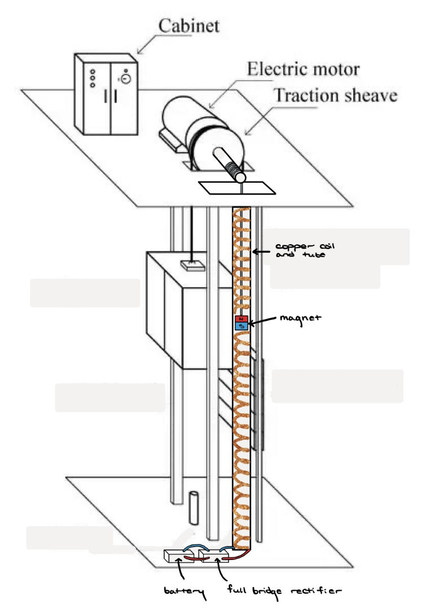
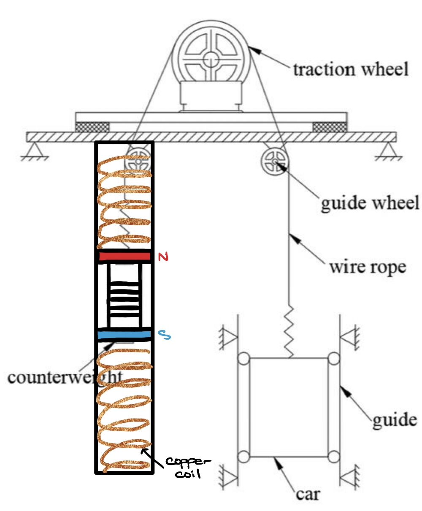

# Elevator Energy Recovery System (KLEEMANN Project)

## Overview
This project was completed as part of a global engineering design course in collaboration with KLEEMANN, an international elevator manufacturer.

The objective was to develop conceptual designs for kinetic energy recovery systems (KERS) and evaluate lifecycle management strategies to improve energy efficiency and sustainability in elevator systems.

This work focused on system-level design, modeling, and engineering analysis rather than physical implementation.

## Key Objectives
- Reduce energy losses during elevator operation  
- Develop methods to recover kinetic energy during braking  
- Improve lifecycle efficiency and sustainability  
- Explore scalable and cost-effective engineering solutions  

## My Contributions
- Contributed to the conceptual design of energy recovery systems  
- Analyzed coil-magnet systems using electromagnetic induction (Faraday’s Law)  
- Evaluated tradeoffs between multiple design approaches  
- Participated in system-level modeling and engineering analysis  
- Collaborated in a multidisciplinary global engineering team  

## Kinetic Energy Recovery System (KERS)

### System Concept

Conceptual design showing a coil-magnet system integrated into an elevator. As the elevator moves, the relative motion between the magnet and coil induces voltage, which can be rectified and stored as electrical energy.

### Alternative Design: Counterweight Integration

Alternative approach where the energy recovery system is integrated into the elevator counterweight, reducing system complexity and improving mechanical integration.

## Engineering Analysis
- Applied Faraday’s Law to model induced voltage  
- Evaluated system parameters such as magnetic field strength, coil geometry, and resistance  
- Analyzed power output, efficiency, and feasibility  
- Compared multiple designs based on cost, complexity, and performance  

## Lifecycle & Sustainability
- Explored circular economy strategies for elevator systems  
- Evaluated remanufacturing and reuse of components  
- Investigated Industry 4.0 concepts such as smart manufacturing  
- Considered environmental impact and regulatory requirements  

## Industry Presentation Experience
Presented project findings and design concepts to KLEEMANN R&D engineers in a formal presentation setting.

- Communicated technical concepts and system designs to industry professionals  
- Responded to questions, feedback, and engineering concerns in a live Q&A  
- Defended design decisions and evaluated alternative approaches  

## Key Concepts
- Kinetic Energy Recovery Systems (KERS)  
- Electromagnetic induction  
- Energy conversion and storage  
- Life Cycle Management (LCM)  
- Sustainable engineering  
- System-level design and tradeoff analysis  

## Project Structure
/docs    -> Full project report  
/media   -> Diagrams and visuals  

## Full Report
See full project report:  
`docs/project_report.pdf`

## What I Learned
- Designing engineering systems without physical prototypes  
- Applying physics and modeling to real-world problems  
- Evaluating tradeoffs between competing designs  
- Working in a global, multidisciplinary engineering team  
- Understanding sustainability in large-scale industrial systems  
